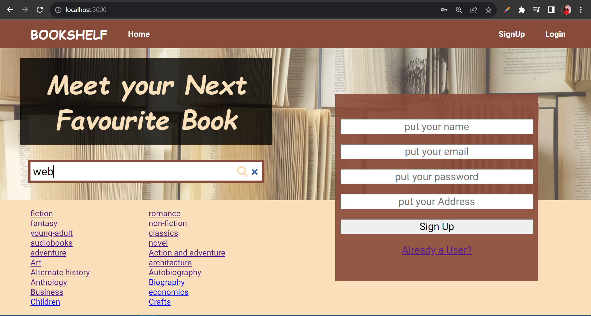
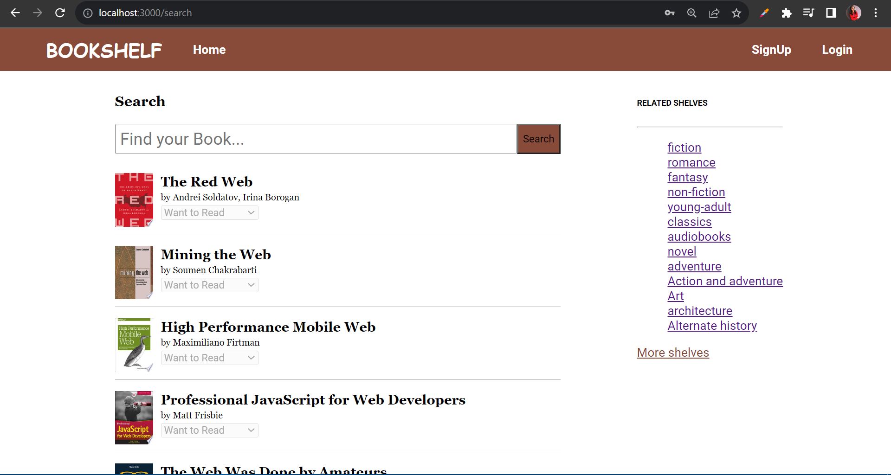
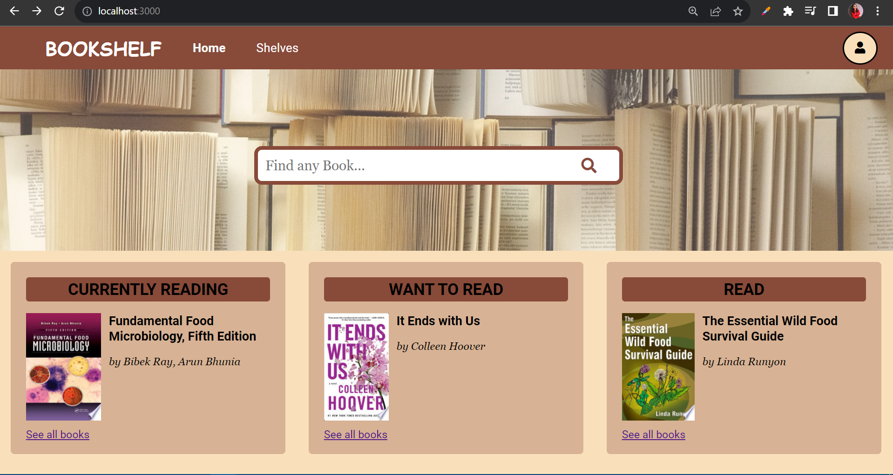

# BookShelf

Bookshelf is a mini social network dedicated to book lovers and enables a place for readers to curate their favourite book titles.

## Table of Contents

- [BookShelf](#bookshelf)
  - [Table of Contents](#table-of-contents)
  - [Demo](#demo)
  - [Features](#features)
    - [User Authentication](#user-authentication)
    - [Searching Feature](#searching-feature)
    - [Customize Bookshelf](#customize-bookshelf)
  - [Getting Started](#getting-started)
    - [Prerequisites](#prerequisites)
    - [Installation](#installation)

## Demo

Here are some screenshots of our React app in action:








## Features

### User Authentication

- **Description**: Our app provides a secure user authentication system, allowing users to sign up, log in, and manage their accounts.

- **How it works**: User data is securely stored, and only authenticated users can access certain features.

### Searching Feature

- **Description**: Our app includes a searching  feature that enables users to search different types of books with different genres.
- **Value**: Facilitates users to stay updated about upcoming books. Perfect for Book Lovers.
- **How it works**: We have used Google Books API so the data is coming from trustful resource.

### Customize Bookshelf

- **Description**: We allow users to create shelves and make their own collection.
- **Value**: Helps users in arranging books and distinguish them in differnet shelves.
- **How it works**: We made personal shelves like currently reading, Want to Read and Read to facilitate the user.

## Getting Started

This is how you need to set up the project on the your local machine.

### Prerequisites

These are the software or dependencies that need to be installed for your app to work.

- Node.js (version X.X.X)
- npm or Yarn

### Installation

Step-by-step instructions on how to install and run your React app.

1. Clone the repository:
   ```sh
   git clone https://github.com/yourusername/your-react-app.git
